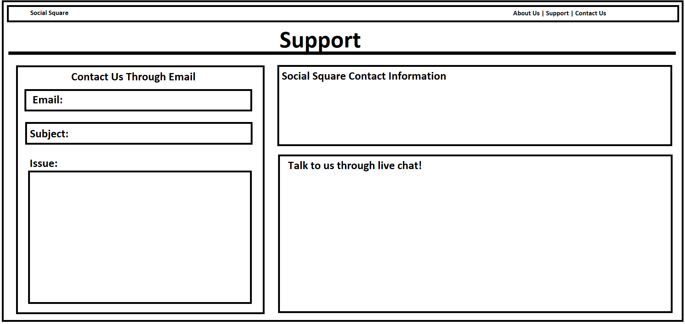

### Deliverable Two

**1. Positioning** 
	
- **1.1 Problem Statement**
  - The problem of disorganized events affects young adults and up, the impact of which is wasting time and potentially unsafe environments.

- **1.2 Product Position Statement** 
  - For young adults and up who want to go out to events, SocialSquare, is a website that makes it easier to plan and find quality parties and events; unlike meetup.com, our product has a rating system to promote positive experiences.

- **1.3 Value Proposition and Customer Segment**
  - Value Proposition: SocialSquare is an event planning website that allows young adults and more to plan and attend events, with the addition of a rating system that allows users to make informed choices.

  - Customer Segment: Young adults and older who want to attend or host parties and events.

**2. Stakeholders**
- **Users**
	- People who are going to use the website to attend, plan, or rate events and parties.
	- Age: Young Adults and older
	- Responsibilities: None
- **Competitors**
	- Companies that have already developed websites/apps that are similar to our idea.
	- Social Media companies
	- Specific Examples: Meetup.com, Facebook, etc...
- **Developers**
	- We the developers are going to be making the website. We are responsible for everything. 
	- The Team: Ryan D, Connor M, Monika B, Shayne S, Ryan M, Brett L 

**3. Functional Requirements**
1. Users can create and manage their account
2. Users can create event listings.
3. Users can RSVP to event listings.
4. Users can rate past events and parties.
5. If a user has hosted parties in the past, they get an averaged rating based off all the past ratings. 
6. Users can opt-in to have email reminders for upcoming events.
7. Users can filter upcoming events by area code.
8. A user can blacklist other users so they cannot RSVP to their events.
9. A user can favorite another user if they like their events a lot.
10. When favoriting a user, one can select to have emails sent about upcoming events. 
11. Users can access a support system if needed.

**4. Non-functional Requirements**
1. Usability: 8 out of 10 testers can use the site without any assistance 
2. Speed: 9 out 10 testers can use the site without any performance issues
3. Security: 8 out of 10 testers are fine with our security measures
4. Accessibility: Avoids small text and overuse of bright colors
5. Performance: 9 out of 10 testers will not experience performance issues
6. Quality Code: 7 out of 10 developers will be fine with maintaining the website
7. Readability: 9 out of 10 testers will be satisfied with the readability of the site
8. Reliability: With the use of Azure, 9 out of 10 testers will not run into problems with reliability
9. Resource Constrained: File size constraints are in place to ensure that no testers run into issues

**5. MVP**
	
Our minimum viable product is going to include most of the fundamental features. To begin, each user can create an account. The user can log in to their account, and choose to be a host or just a party attendee. 
If the user is a host, they can post and delete upcoming events. Attendees can filter by location, to see all of the upcoming events in their area. 
Attendees will be able to RSVP to these events as well. Attendees can also rate past events that they have gone to. Hosts will get an overall rating, which is an average of all of their past event's ratings.
This will all be tested by first prototyping, then implementing. Once it is implemented, we will gather feedback and adjust accordingly. 

**6. Use cases**
	
- **6.1 Use case diagram**
	

- **6.2 Use case descriptions and interface sketch**
	- Use Case: View Ratings
		1. Brief Description: User can view the ratings that have been left on a host's page
		2. Actors: User
		3. Preconditions: None
		4. Main Flow of Events
			- Use case begins when user clicks on host's rating.
			- Use Case: View Ratings
			- Webpage displays all of the past ratings that other attendees have left on the host's page
			- User can interact with ratings by liking them.
			- User can scroll down to view more ratings. 
			- If there are many ratings, a user can move pages to view more ratings.
			- User can leave the page
			- Use case ends successfully 
		5. Alternative Flow
			- User can click logo/name in top left to return to home page
			- User can click search bar, enter a new zip code, and search for other parties
			- User can click the support button if they need support
			- User can click the about us button if they want to learn about the company
			- User can click on the connect button if they want to get in contact with the company
			- User can scroll down to view other information
		6. Key Scenarios
			- User wants to leave a rating
		7. Post-conditions
			- User views all of the ratings
			- If failure, log
		8. Special Requirements
			- None
	
		Use Case UI Sketch:

		

	- Use Case: Favorite Hosts
		1. Brief Description: On a host's page, allow for a user to add that host to their list of favorite hosts.
		2. Actors: 
 			- 2.1 Attendee
 			- 2.2 Hosts 
		3. Precondition
			- Be on the host's page.
 			- The user is logged into their account.
		4. Basic Flow
			1. The use case begins when an attendee or host visits a host's page.
			2. Attendee or host presses the favorite button.
			3. The system checks that the attendee or host is logged in.
			4. System adds the favorited host to the attendee or host's account's favorite list.
			5. The use case ends. 
		5. Alternative Flows
 			- 5.1 User not logged in.
 				- If in step 3 the system sees that the user is not logged in, it will prompt the user to log in or create an account.
 			- 5.2 Host to be favorited is already favorited.
				- If in step 2 the user already has the host favorited, remove the host from their favorite list.
 			- 5.3 No response from the webserver.
 				- If the website can't be reached, the use case ends in step 1 or 2.
		6. Key Scenarios
 			- 6.1 No response from the webserver
		7. Post-conditions
 			- 7.1 Successful completion
 				- The user has favorited a host and can view them in their list of favorites.
 			- 7.2 Failure condition
 				- No changes.
		8. Special Requirements
 			- None.

		Use Case UI Sketch:

		

	
	- Use Case: RSVP For a Party/Event
		1. Actor: 
			- Potential Attendee
		2. Description: 
			- The user reserves a spot (either gets an invitation to an event, or finds an event with open spots for reservations).
		3. Pre-Conditions: 
			- The user has registered for an account and finds an event that requires a reservation.
		4. Post-Conditions: 
			- The host now knows that a user has reserved a spot to the event.
		5. Main Flow:
   			- 5.1. The user gets a party invitation or the user finds a party from the event browser.
   			- 5.2. The user can choose whether to reserve their spot or remove the event from their event browser.
   			- 5.3. Before making a decision, the user can view photos of the host's past parties or photos of the current party. Also, the user can see the host's reviews and ratings.
   			- 5.4. Once the decision has been made, the host is notified and the user is ready to go.
		6. Key Scenarios
   			- 6.1 The invitation is no longer valid/has expired
		7. Special Requirements
   			- [SpReq:WC-1] The user has an invitiation
   			- [SpReq:WC-2] The party/event is open for reservations

		Use Case UI Sketch:
	
		

	- Use Case: View Events
		1. Actor: 
			- Attendee
			- Host
			- Non-Account holders
		2. Description: 
			- User can visit the events page and view all listed events (attached event information) within the given area code.
		3. Pre-Conditions: 
			- N/A
		4. Main Flow:
			- The use case begins when the user opens the events page.
			- Web Page lists all events and their descriptions within provided area code
			- User can click on the event to learn more
			- User can scroll down to find more events
			- User can sort events based off ratings
			- User can then use nav bar to return to home page
			- Use Case ends
		5. Alternative Flow:
			- If in step 3 of the main flow the system:
				- Opens up a pop up window with the event information
				- User can then click out of the pop up window
				- Returns to the main event page
				- The use case resumes at step 4
		6. Key Scenarios:
			- Click on an event, step 3
			- Sorting events, step 5
		7. Post Conditions:
			- N/A
		8. Special Requirements:
			- N/A

		Use Case UI Sketch:

		

		- Use Case: Rate Event
			1. Actor: 
				- User
			2. Description: 
				- The user can view information from the event. Below the information, there is an option to give the event up to 5 stars. Users can also leave a comment and read comments left by other user.
			3. Pre-Conditions:
				- 3.1 You must be registered on the site
				- 3.2 You have to have attended the event to rate it
			4. Main Flow
				- 4.1 The use case begins when the user opens the page of the event they wish to rate and have attended.
				- 4.2 The user can view all provided information about the event and other ratings made by other attendees
				- 4.3 User can leave a 5 star review and any specific comments they wish to add
				- 4.4 User can then use the nav bar to return to the home page
				- 4.5 Use Case ends
			5. Alternative Flow:
				- N/A
			6. Key Scenarios:
				- 6.1 Make a /5 star review, step 3
				- 6.2 Add/write any comments they wish to, step 3
			7. Post Conditions:
				- 7.1 Future users know how the host did with the event
				- 7.2 The host gets feedback on where to improve and adjust
				- 7.3 Adds a layer of safety for users to make sure they attend events from only reputable hosts
			8. Special Requirements:
				- [SpReq:WC-1] The user attended the event.

		
		
		Use Case UI Sketch:
	
		

		- Use Case: Access Support System
			1. Actor
				- Attendee
				- Host
				- Non-Account holders
			2. Description:
			 	- User can visit the support page and seek support from the development team
			3. Pre-Conditions: 
				- N/A
			4. Main Flow:
				- The use case begins when the user opens the support page.
				- User can view SocialSquare contact information
				- Web page provides a form that can be filled out to be contacted through email
				- User can select live chat option to get immediate support
				- User can then use nav bar to return to home page
				- Use Case ends
			5. Alternative Flow:
				- If in step 4 of the main flow the system:
					- Opens up a pop up window with a live chat with a support employee
					- User can communicate with the employee to seek support
					- When all support is done user clicks out of window
					- Returns to the main event page
					- The use case resumes at step 5
			6. Key Scenarios:
				- Click on an livechat, step 4
			7. Post Conditions:
				- N/A
			8. Special Requirements:
				- N/A

		Use Case UI Sketch:
		
		

**7. Use cases**

**8. Trello**
