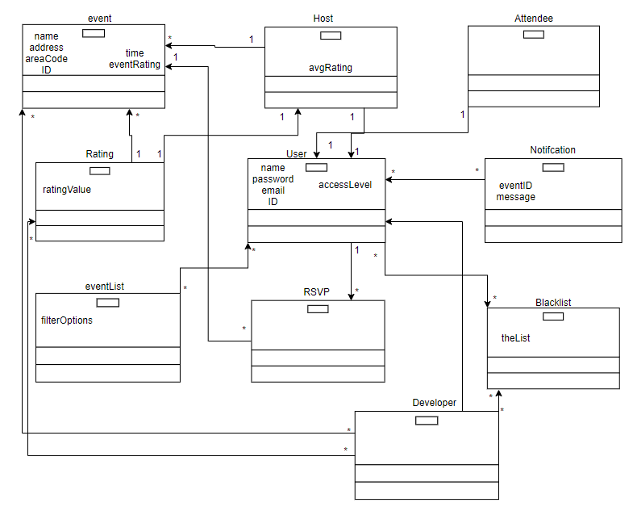

### Deliverable Three

**1. System Description**

SocialSquare is an **event** planning website that allows young adults and more to *create and view* events, with the addition of a *rating* system that allows users to make informed choices. We are designing this system for young adults and up who want to go out to **events**. It is a website that makes it easier to plan and find quality parties and events; unlike meetup.com, our product has a rating system to promote positive experiences. We want to solve the problem of how disorganized events affect young adults and up, which wastes time and potentially unsafe environments.

The stakeholders of our product will consist of **users**, competitors, and **developers**. A **user** will be able to choose if they want to be an event **host** or just an **attendee**. If the user is a **host**, they get a few more features including being able to make **events**, view *party attendees*, and **blacklist** users. The other option for a user is to be an **attendee**. **Hosts** are able to do everything that **attendees** can do, except on their own events. 

An **attendee** can create and manage their account, RSVP to **events**, rate past **events**, opt-in to email notifications, search for parties and <ins>favorite</ins> certain **hosts** that they like. Users can also access a support system if needed. **Events** created by a **host** will have an associated **rating** depending on how attendees rated the event. This event **rating** will also determine the *host’s rating*. Users will be able to search through an **event list** and filter out distant **events** based on their area code. They can also sort **events** by *host rating* and filter out low host ratings. Also, a user can <ins>favorite</ins> a **host** if they attended an event and liked how the **host** did, so that the user doesn’t miss future **events** from that **host**. 

**Developers** will be able to take user reports of unruly **users**. If they decide a **user** is too troublesome, they can ban or suspend user accounts. **Developers** will also be able to delete **listings** or **ratings** that are junk or otherwise unsuited for the website.

**2. Model**

