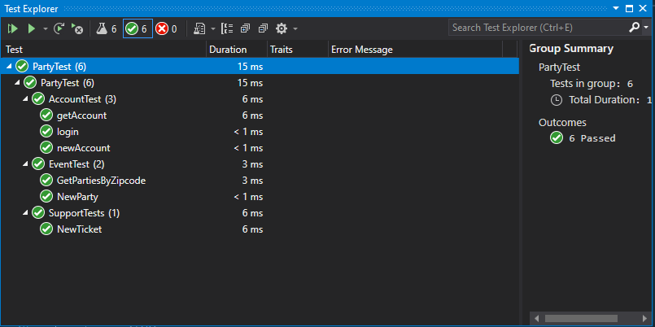
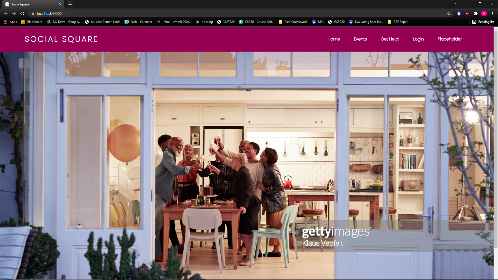
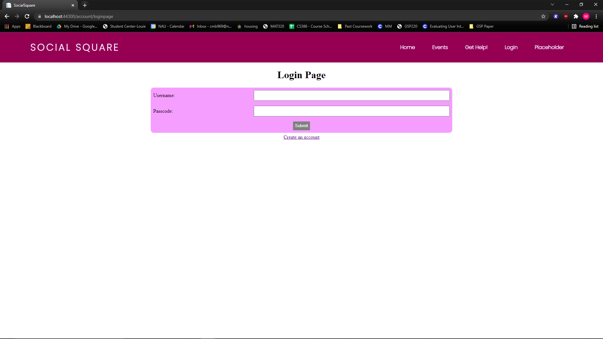
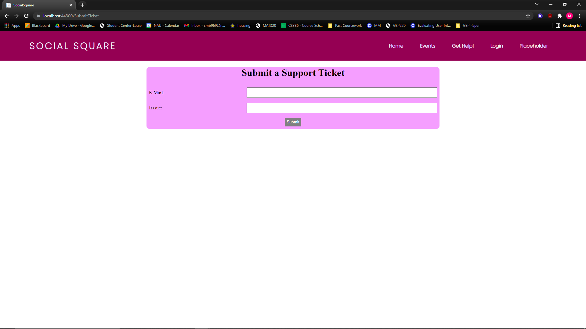

# 1. Introduction
SocialSquare is an event planning website that allows young adults and more to plan and attend events, with the addition of a rating system that allows users to make informed choices. Our MVP we have created allows a user to go in and sign up as either a host or an attendee. When signing up the user is required to provide some basic information (username, Name, password, location, zip code, host/not host). If you sign up as an attendee you will have the ability to access the events page and view all current listed events as well as access your account and the support page to create a ticket.. If you sign up as a host you have the ability to create and delete events as well as all abilities given to the attendee. Lastly we created a home page that gives the user an introduction to Social Square and allows for easy navigation throughout the rest of the website.

# 2. Implemented Requirements
- Requirement: As a user I want to be able to navigate throughout the website.\
Issue: https://trello.com/c/ZmblUpzd\
Pull request: https://github.com/rdemboski/cs386_Group3/pull/15\
Implemented by: Ryan Mason\
Approved by: Shayne Sellner\
Print screen: A print screen that depicts the implemented feature (if applicable)
- Requirement: As an attendee I want to be able to filter events by zip code\
Issue: https://trello.com/c/SDFnCuAW\
Pull request: https://github.com/rdemboski/cs386_Group3/pull/24\
Implemented by: Brett Lewerke\
Approved by: Ryan Demboski\
Print screen: A print screen that depicts the implemented feature (if applicable)

- Requirement: As an attendee I want to be able to view all listed events\
Issue: https://trello.com/c/n443kdaG\
Pull request: https://github.com/rdemboski/cs386_Group3/pull/25\
Implemented by: Ryan Demboski (accidentally done directly through main)\
Approved by: Ryan Demboski\
Print screen: A print screen that depicts the implemented feature (if applicable)

- Requirement: As a user I want to be able to contact the websites support team in case of technical issues\
Issue: https://trello.com/c/cyKBkXJp\
Pull request: https://github.com/rdemboski/cs386_Group3/pull/27\
Implemented by: Shayne Sellner\
Approved by: Ryan Demboski\
Print screen: A print screen that depicts the implemented feature (if applicable)

- Requirement: As a user I want to be able to create an account on the website\
Issue: https://trello.com/c/qcEJe6P5\
Pull request: https://github.com/rdemboski/cs386_Group3/pull/23\
Implemented by: Monika Beckham\
Approved by: Ryan Demboski\
Print screen: A print screen that depicts the implemented feature (if applicable)

# 3. Tests
- xUnit
- https://github.com/rdemboski/cs386_Group3/tree/main/PartyTest
- Test case: Logging into an account by matching user input and existing account data. 
- Class: https://github.com/rdemboski/cs386_Group3/blob/main/PartyApplication/Controllers/AccountController.cs
- Test:
https://github.com/rdemboski/cs386_Group3/blob/main/PartyTest/UnitTest1.cs\

# 4. Adopted Technologies
- Microsoft Azure Cloud Service\
All in one environment for database backend and web hosting.
- ASP.NET Core web framework\
Compatible web framework for Microsoft Azure.
- Cosmos DB backend\
Compatible database system for Microsoft Azure.
- HTML, CSS, Javascript, C#\
The necessary languages needed to construct the website using our adopted technologies.

# 5. Learning/training
- Watched video tutorials of Azure, Cosmos DB, and ASP.NET Core on YouTube.
- Worked at the same time and learned from each other (sharing screens and watching, etc) when developing the MVP.
- Crash courses from Brett to help explain how the system works prior to and during development.
- Research ASP.NET documentation when stuck on a programming related problem.

# 6. Deployment
We are utilizing Microsoft Azure to put our website online and available for people to interact with. We are also using Azure to manage and store all of our programs data using free credit given to students, this same credit applies to putting our website on the internet.

# 7. Licensing
MIT License\
https://github.com/rdemboski/cs386_Group3/blob/main/LICENSE

# 8. Readme File
- Readme: https://github.com/rdemboski/cs386_Group3/blob/main/README.md
- License: https://github.com/rdemboski/cs386_Group3/blob/main/LICENSE
- Code of conduct: https://github.com/triple-lariat/cs386_Group3/blob/main/CODE_OF_CONDUCT.md
- Contributing: https://github.com/rdemboski/cs386_Group3/blob/main/CONTRIBUTING.md

# 9. Look & Feel
We wanted the website to have a similar feel in a web browser to social media websites like Facebook. The navigation bar was designed to get the user to every major part of the website easily, while looking professional and with colors and text fonts that aren’t distracting to the user. The same can be said for the rest of the website’s art style.

Screenshots:
\
Note: Stock image used as placeholder.\
\

# 10. Lessons Learned
After finally constructing the MVP for our product, we learned that it was a very tedious process to get the development environment (Visual Studio and GitHub integration) up and running correctly with our project, and we should have prepared earlier for that. In the final stages of our MVP development the process felt much better and more fluid when we all got the hang of our development environment and workflow. Now that we all have an understanding of the system and built a foundation to expand from, we think the development for the next implementation will go more smoothly.

# 11. Demo
TODO