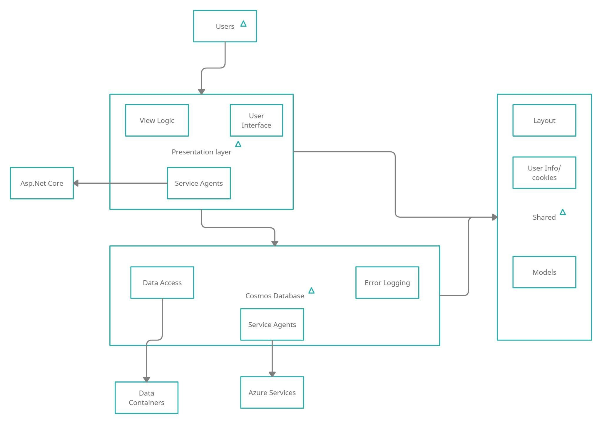
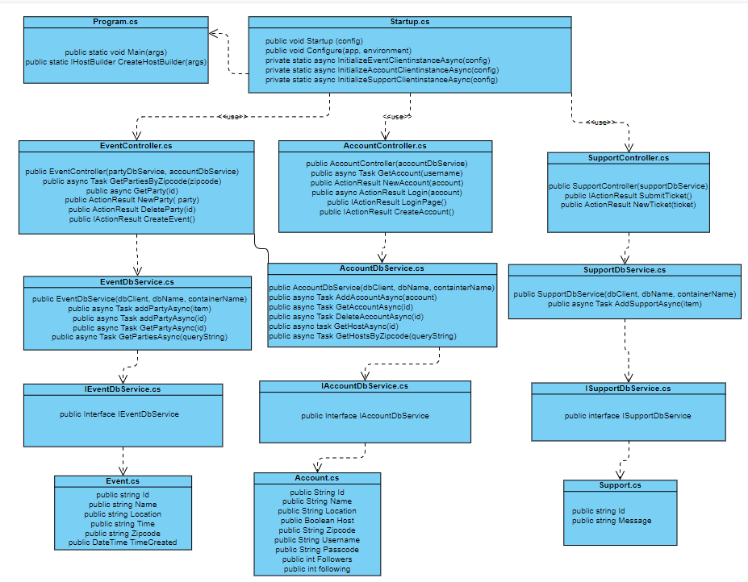
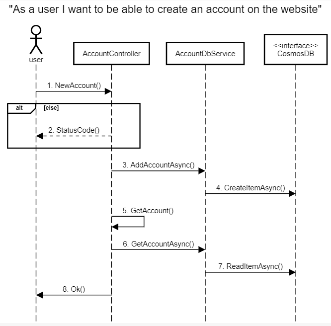
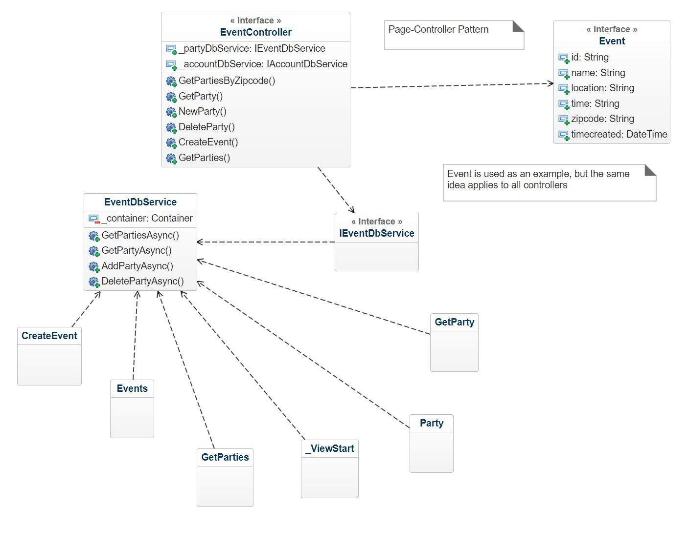
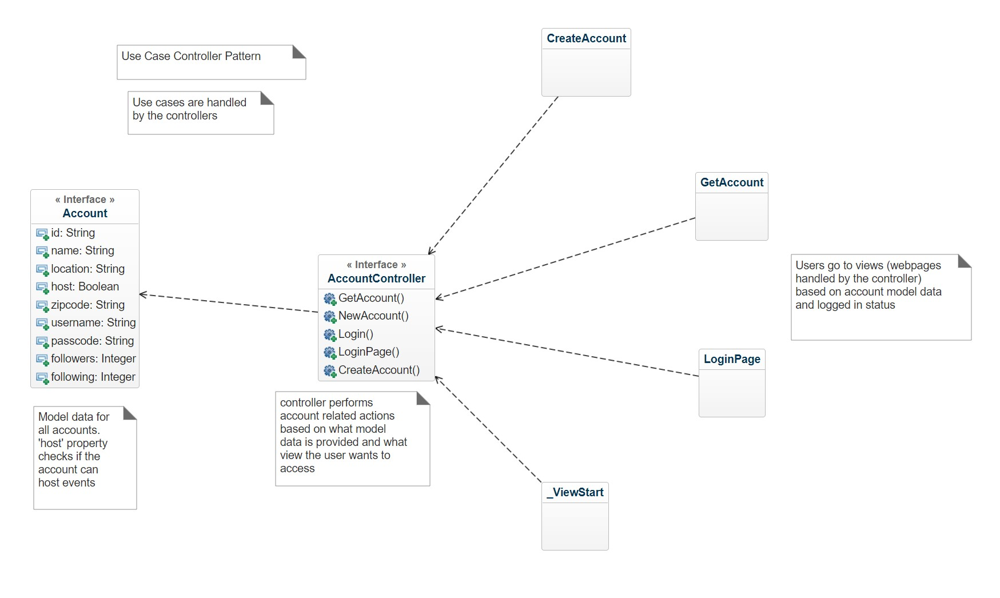

# 1. Description
SocialSquare is an event planning website that allows young adults and more to plan and
attend events, with the addition of a rating system that allows users to make informed
choices. Our website we have created allows a user to go in and sign up as either a host or an
attendee. When signing up the user is required to provide some basic information
(username, Name, password, location, zip code, host/not host). If you sign up as an
attendee you will have the ability to access the events page and view all current listed
events as well as access your account and the support page to create a ticket.. If you sign
up as a host you have the ability to create and delete events as well as all abilities given to
the attendee. Another feature we added was the ability for all registered users to filter events based off of their respective area codes. Lastly we created a home page that gives the user an introduction to Social Square and allows for easy navigation throughout the rest of the website.

# 2. Architecture

Users in this system are represented by a model and communicate with the presentation layer and the cosmos database accordingly. Diagram shows data sources being used by the presentation layer and the data being accessed through Azure methods and classes. Both presentation layer and cosmos database share models and presentation layer views use layouts and cookies accordingly.

# 3. Class Diagram

# 4. Sequence Diagram

# 5. Design Patterns

EventController: https://github.com/rdemboski/cs386_Group3/blob/main/PartyApplication/Controllers/EventController.cs

Event: https://github.com/rdemboski/cs386_Group3/blob/main/PartyApplication/Model/Event.cs

EventDbService: https://github.com/rdemboski/cs386_Group3/blob/main/PartyApplication/DbServices/EventDbService.cs

IEventDbService: https://github.com/rdemboski/cs386_Group3/blob/main/PartyApplication/IDbServices/IEventDbService.cs

Event Classes: https://github.com/rdemboski/cs386_Group3/tree/main/PartyApplication/Views/Event 

AccountController: https://github.com/rdemboski/cs386_Group3/blob/main/PartyApplication/Controllers/AccountController.cs

Account: https://github.com/rdemboski/cs386_Group3/blob/main/PartyApplication/Model/Account.cs

Account Classes: https://github.com/rdemboski/cs386_Group3/tree/main/PartyApplication/Views/Account

# 6. Design Principles
Each class/view in the system has a single responsibility. For example, the account class only contains account information, and the event class only contains event information. Each class has a corresponding controller class attached to it to handle and view the information in that class.

The code follows the Open/Closed Principle. There are not any if statements of cases.

Our code does not contain any classes that contain subclasses so the Liskov Substitution Principle would not apply.

The Interface Segregation Principle is followed, because attendees can only see and rate events, whereas hosts can create new events.

Our code does not apply the Dependency Inversion Principle since the accountController depends on IAccountDbService, which is a lower class.

