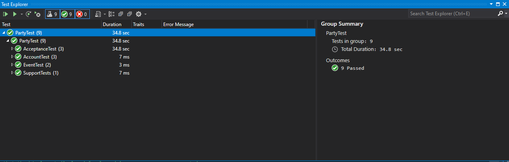

# 1. Introduction
SocialSquare is an event planning website that allows young adults and more to plan and attend events, with the addition of a rating system that allows users to make informed choices. Our website we have created allows a user to go in and sign up as either a host or an attendee. When signing up the user is required to provide some basic information (username, Name, password, location, zip code, host/not host). If you sign up as an attendee you will have the ability to access the events page and view all current listed events as well as access your account and the support page to create a ticket. If you sign up as a host you have the ability to create and delete events as well as all abilities given to the attendee. Another feature we added was the ability for all registered users to filter events based off of their respective area codes. Lastly we created a home page that gives the user an introduction to Social Square and allows for easy navigation throughout the rest of the website.

# 2. Verification (Tests)
## 2.1 Unit Test
- 2.1.1 - xUnit
- 2.1.2 - https://github.com/rdemboski/cs386_Group3/tree/main/PartyTest
- 2.1.3 - Class: account https://github.com/rdemboski/cs386_Group3/blob/main/PartyApplication/Model/Account.cs 
    
    Test: https://github.com/rdemboski/cs386_Group3/blob/main/PartyTest/UnitTest1.cs
- 2.1.4 
## 2.2 Acceptance Test
- 2.2.1 - Selenium
- 2.2.2 - https://github.com/rdemboski/cs386_Group3/tree/main/PartyTest
- 2.2.3 - 
    SearchEventsTests: https://github.com/rdemboski/cs386_Group3/blob/main/PartyTest/AcceptanceTest.cs tests the ability of a user to log in, view events, search by zipcode, then view the details of an event from the searched zipcode.
- 2.2.4 - https://youtu.be/qzm0NRwBIgE

# 3. Validation (user evaluation)
## Script
1. Have the user navigate to the website
2. On a scale of 1 to 10, how satisfied are they with the home page?
3. Have the user then create an account
4. Have the user log into their account - make sure it is a host account
    - Ask what their opinions on account creation/logging in is
5. Have the user navigate to the events page 
6. Have the user create a new event
    - On a scale of 1 to 10, how satisfied are they with creating new events
7. Have the user navigate back to the events page
    - How do they like the look of the main events page?
8. Have the user click details on their event
    - Is the user interface sufficient?
    - Users can delete their event if they want to test that as well.
9. Have the user go back to the events page, click on a different event, and rate it.
    - Is the rating system easy to understand? Does the rating system reflect the rating system that they desired?
10. Have user click on the host’s account of that event, and follow them
    - Does the host page have sufficient information? Is the following system easy to understand? 
11. Finally, have the user submit a support ticket
    - Is the support page easy to navigate? Are there missing text fields?
12. Have user log out of their account
    - Ask the user for their overall experience with the site. What would they like to see, especially compared to similar sites?

## Results
### Interview 1
1. Have the user navigate to the website
2. On a scale of 1 to 10, how satisfied are they with the home page?
    
    ***10, simple, clean, nice. Likes how it is simple, and easy to navigate. Most websites are very complicated and hard to use.***
3. Have the user then create an account
4. Have the user log into their account - make sure it is a host account
    - Ask what their opinions on account creation/logging in is
    
    ***Could look a little bit nicer, the process was easy, but the UI is simple and old.***
5. Have the user navigate to the events page 
6. Have the user create a new event
    - On a scale of 1 to 10, how satisfied are they with creating new events
    
    ***Again, very simple UI. 9 out of 10 when it comes to functionality, but the design of the page was lacking.***
7. Have the user navigate back to the events page
    - How do they like the look of the main events page?
    
    ***Again, simple, bland. 6/10 for now.***
8. Have the user click details on their event
    - Is the user interface sufficient?
    
    ***Simple and bland. However, all of the information is displayed and it is very easy to see.***
    - Users can delete their event if they want to test that as well.
9. Have the user go back to the events page, click on a different event, and rate it.
    - Is the rating system easy to understand? Does the rating system reflect the rating system that they desired?
    
    ***The UI makes it a bit hard to see, but it is easy to understand. Yes this rating system reflects what the customer wanted.***
10. Have user click on the host’s account of that event, and follow them
    - Does the host page have sufficient information? Is the following system easy to understand? 
    
    ***The page does have enough information on it, and the following system makes sense.***
11. Finally, have the user submit a support ticket
    - Is the support page easy to navigate? Are there missing text fields?
    
    ***The support page was easy to navigate. They do not think that it was missing anything.***
12. Have user log out of their account
    - Ask the user for their overall experience with the site. What would they like to see, especially compared to similar sites?
    
    ***They thoroughly enjoyed the website, it was a very nice time using social square. They suggested adding an extra text box to the events page for the event details, they also suggested improving the UI of the website overall.***

### Interview 2

1. Have the user navigate to the website
2. On a scale of 1 to 10, how satisfied are they with the home page?
    
    ***7, they wished that the homepage could have had more detail to it, and it was very basic.***
3. Have the user then create an account
4. Have the user log into their account - make sure it is a host account
    - Ask what their opinions on account creation/logging in is

    ***The login page is nice, very easy to understand. The UI could be improved.***
5. Have the user navigate to the events page 
6. Have the user create a new event
    - On a scale of 1 to 10, how satisfied are they with creating new events

    ***8, like the login page, it is very easy to understand, but the UI is lacking.***
7. Have the user navigate back to the events page
    - How do they like the look of the main events page?

    ***The look is simple, and could be improved, but overall it is nice looking.***
8. Have the user click details on their event
    - Is the user interface sufficient?

    ***Yes, it provides all of the information entered, but it is a bit simple.***

    - Users can delete their event if they want to test that as well.
9. Have the user go back to the events page, click on a different event, and rate it.
    - Is the rating system easy to understand? Does the rating system reflect the rating system that they desired?

    ***The rating system is a bit confusing, because the rating boxes and labels are quite small, and easy to overlook. However, once they saw them, it was easy to understand how to rate a host.***
10. Have user click on the host’s account of that event, and follow them
    - Does the host page have sufficient information? Is the following system easy to understand?

    ***The host page shows all of the needed information that is needed. The following system was easy to understand.*** 
11. Finally, have the user submit a support ticket
    - Is the support page easy to navigate? Are there missing text fields?

    ***The support page is simple and clean. They do not think that there are missing text fields.***
12. Have user log out of their account
    - Ask the user for their overall experience with the site. What would they like to see, especially compared to similar sites?

    ***Their overall experience of using the site was nice, and they had no big complaints. The website UI is its biggest drawback to them, making it look dated.***

### Interview 3

1. Have the user navigate to the website
2. On a scale of 1 to 10, how satisfied are they with the home page?
    
    ***8.5, Would have liked some more information over the slideshow, otherwise simple and good looking.***
3. Have the user then create an account
4. Have the user log into their account - make sure it is a host account
    - Ask what their opinions on account creation/logging in is

    ***UI should have a updated look/feel to them. Otherwise the function of the account creation/login works perfectly***
5. Have the user navigate to the events page 
6. Have the user create a new event
    - On a scale of 1 to 10, how satisfied are they with creating new events

    ***7/10, functionality again is there however they were not impressed with the design of the event creation page.***
7. Have the user navigate back to the events page
    - How do they like the look of the main events page?

    ***4/10 font inconsistencies relative to other pages, and ultimately could look a lot better.***
8. Have the user click details on their event
    - Is the user interface sufficient?

    ***Way too simplistic looking, user wants a more refined look to it.***

    - Users can delete their event if they want to test that as well.
9. Have the user go back to the events page, click on a different event, and rate it.
    - Is the rating system easy to understand? Does the rating system reflect the rating system that they desired?

    ***Rating system is effective, still needs UI improvements, and we need to restrict the ability for people to select more than one number for rating.***
10. Have user click on the host’s account of that event, and follow them
    - Does the host page have sufficient information? Is the following system easy to understand?

    ***There is definitely enough information and it is easy to understand according to the user.*** 
11. Finally, have the user submit a support ticket
    - Is the support page easy to navigate? Are there missing text fields?

    ***Support page was straightforward and effective.***
12. Have user log out of their account
    - Ask the user for their overall experience with the site. What would they like to see, especially compared to similar sites?
    
    ***Overall they thought the website's functionality was very good, but they made several complaints about the look and feel of the website as a whole. Otherwise they thoroughly enjoyed themselves.***

## Reflection
- The main features of our website all worked pretty well. These included account creation, event creation, host rating, event viewing, the support page, and cookies. The main focus point of all of the interviews was the UI. The UI was very basic in many parts of the website, making it feel old and a bit simple. The UI should be the center focus of most future improvements. Another improvement to add would be a description of an event. The users actions did produce what they expected, although one said it should already log you in once you create a new account, instead of making you log in manually. Most of the users liked how the website was intuitive to use. They did not struggle with most of the UI elements, and they could find their way around the website quite easily. Our value proposition was accomplished!